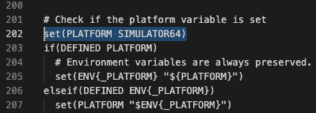
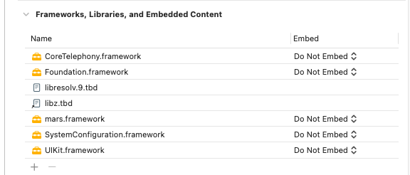

# iOS Mars XLog日志集成

## 简介
  由于直接写入文本日志文件太大，使用xlog日志减小日志文件的大小。

## mars.framework编译
  由于Mars是采用C++编写，我们需要编译Mars才可以导入到iOS项目中。自行编译方便原码修改满足自己的需求；

* 下载mars官方文件

  [下载地址](https://github.com/Tencent/mars)

* 安装cmake

  brew install cmake

* 安装cmake

  brew install python3

* 编译 

  1.修改 ios.toolchain.cmake

  if(DEFINED PLATFORM)前插入 set(PLATFORM SIMULATOR64) SIMULATOR64:x86_64 OS:arm64

    

  2.cd到mars文件下运行python build_ios.py
  生成 mars.framework


## 使用

导入framework到项目
将/mars/mars/cmake_build/iOS/Darwin.out/mars.framework 拖入到iOS项目中

* 导入如下系统Frameworks


    

* 初始化xlog

```
+ (void)setupXlogWithLogPath:(NSString *)logPath {
    const char* attrName = "com.apple.MobileBackup";
    u_int8_t attrValue = 1;
    setxattr([logPath UTF8String], attrName, &attrValue, sizeof(attrValue), 0, 0);
    
    // init xlog
    mars::xlog::appender_set_console_log(false);
    xlogger_SetLevel(kLevelInfo);
    mars::xlog::XLogConfig config;
    config.mode_ = mars::xlog::kAppenderAsync;
    config.logdir_ = [logPath UTF8String];
    config.compress_mode_ = mars::xlog::kZlib;
    config.compress_level_ = 0;
    config.cachedir_ = "";
    config.cache_days_ = 0;
//        config.pub_key_ = "
    appender_open(config);
}
```

* 写入
```
+ (void)writeToFile:(NSString*)str {
    xlogger_Write(NULL, str.UTF8String);
    mars::xlog::appender_flush();
}

```

* 关闭

```
+ (void)closeXlog {
    mars::xlog::appender_close();
}
```

## 获取日志并上传

* 沙盒路径获取Xlog日志文件，并上传。

## xlog日志解析

[XlogDecoder]工具 (https://github.com/JerryFans/mars_xlog_decoder_gui)

无需任何py环境,直接把xlog日志，或文件夹拖到窗口即可。会自动给你解析出相应日志。支持加密与不加密，加密的话需要你手动输入private_key

## 注意事项
* 直接include xlog头文件的 oc 文件名后缀一定要是 .mm 不要使用 .m


